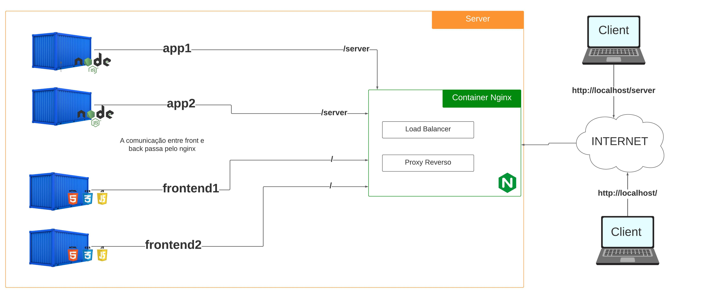

# nginx-study
Praticando os conceitos de **load balancer** e **proxy reverso**, aplicando um exemplo de como funciona as funções no Nginx.
O conteúdo apenas para fins de estudo.
## Setup

### config `./frontend/nginx/nginx.conf`
No `log_format` é substituído o **$remote_addr** para **$http_x_real_ip**
<br>
OBS: Essa alteração serve para o frontend pegar o ip do client e não do nginx principal (container que faz o proxy reverso e o balanço de carga)

### Executar no terminal:
```bash
docker-compose up -d
```
- Cria os containers:
    - **nginx** (Load Balancer, Proxy Reverso)
    - **app1**, a partir da imagem do nodejs
    - **app2**, a partir da imagem do nodejs
    - **frontend1**, a partir da imagem do nginx, criando volume da pasta frontend (`html/index.html`) no caminho (`/usr/share/nginx/html`) do container 
    - **frontend2**, a partir da imagem do nginx, criando volume da pasta frontend (`html/index.html`) no caminho (`/usr/share/nginx/html`) do container 

## Esquema do sistema
